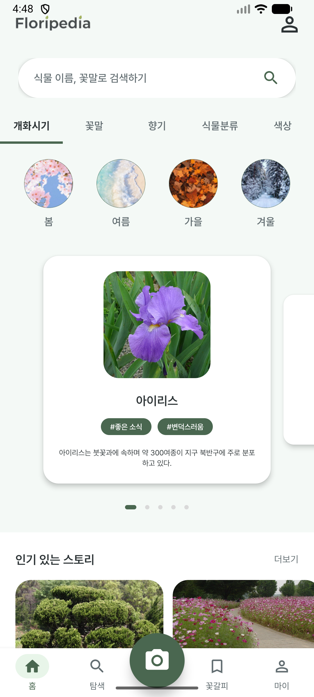
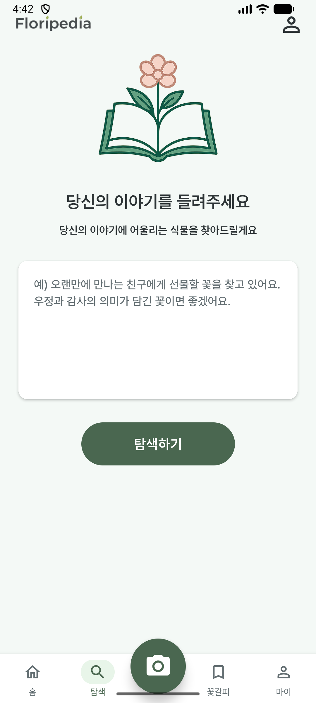
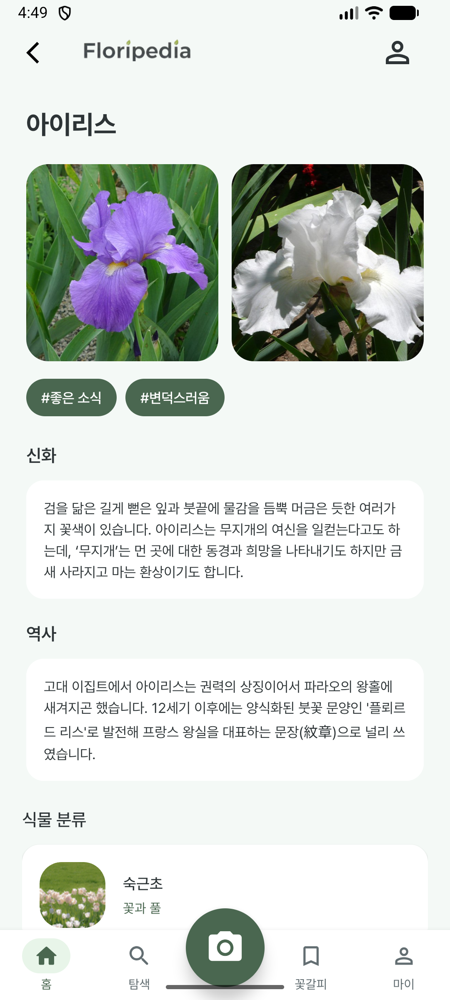
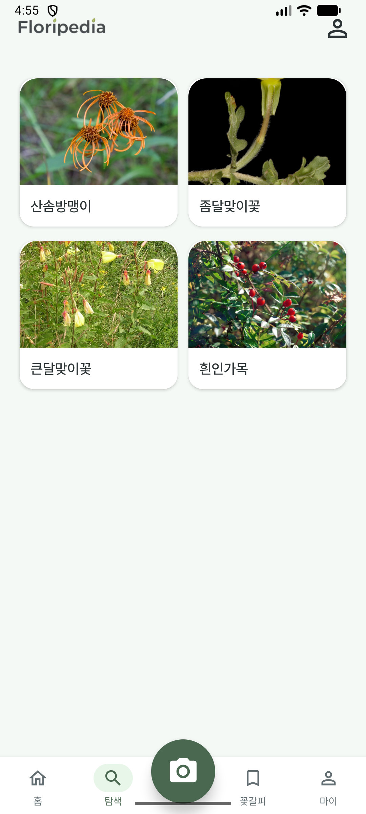

# 🌸 GURU2_floripedia

> **Identify plants with a snap, discover their hidden stories, and find the perfect match for your emotions.**  
> 사진 한 장으로 찾는 식물의 모든 것: 이름부터 숨겨진 이야기, 당신에게 꼭 맞는 추천까지.

Floripedia는 AI 기반 식물 식별, 감성 추천, 그리고 풍부한 식물 정보를 제공하는 통합 플랫폼입니다.

---

## 📑 목차

- [주요 기능](#-주요-기능)
- [화면 구성](#-화면-구성)
- [기술 스택](#-기술-스택)
- [프로젝트 구조](#-프로젝트-구조)
- [시스템 아키텍처](#-시스템-아키텍처)
- [시작하기](#-시작하기)
- [API 문서](#-api-문서)
- [데이터베이스 스키마](#-데이터베이스-스키마)
- [테스트](#-테스트)

---

## 🌟 주요 기능

### 🔍 AI 기반 식물 검색

#### 1. 이미지 검색 (Vision Search)
- **Gemini Vision API** 를 활용한 실시간 식물 식별
- 사진 한 장으로 식물의 한글명, 영문명, 학명 자동 인식
- **3단계 매칭 전략**: 학명 정확 → 이름 정확 → 학명 퍼지(속 기준)
- 사전 큐레이션된 DB 기반의 신뢰할 수 있는 식물 정보 제공

#### 2. 텍스트 기반 추천 (Emotion-Based Recommendation)
- 사용자 상황/감정 입력 시 **AI가 맞춤형 식물 추천**
- Gemini가 상황에 맞는 감성 에세이 자동 생성
- 예시: "친구와 화해하고 싶어요" → "물망초" 추천 + 감동적인 추천 에세이

### 🌿 식물 정보 탐색

#### 다층 필터링 시스템
- **계절별 검색** (봄, 여름, 가을, 겨울)
- **개화 월별 검색** (1~12월)
- **4대 카테고리 그룹**
  - 꽃과 풀
  - 나무와 조경
  - 실내 인테리어
  - 텃밭과 정원
- **5가지 색상 그룹**
  - 백색/미색, 노랑/주황, 빨강/분홍, 푸른색, 갈색/검정
- **4가지 향기 그룹**
  - 달콤·화사, 싱그러운·시원, 은은·차분, 무향
- **5가지 꽃말 감성 그룹**
  - 사랑/고백, 위로/슬픔, 감사/존경, 이별/그리움, 행복/즐거움
- **스토리 장르별 탐색**
  - 신화/전설, 과학, 역사, 예술, 에피소드

#### 상세 정보 제공
- 🏷️ **기본 정보**: 학명, 과명, 원산지, 생육 환경
- 🌈 **색상 정보**: HEX 코드, 색상 라벨, 색상 그룹
- 🌺 **꽃말 & 감성 그룹**: 꽃말 의미와 감성 분류
- 📖 **스토리 컬렉션**: 신화, 역사, 예술 등 다양한 이야기
- 🌱 **원예 정보**: 관리법, 용도, 카테고리 분류
- 👃 **향기 정보**: 향기 태그와 향기 그룹

### 💖 사용자 기능

- **꽃갈피 (찜하기)**: 마음에 드는 식물 저장
- **마이페이지**: 프로필 관리, 찜한 식물 목록 조회
- **Firebase 인증**: Google/Email 소셜 로그인
- **프로필 이미지 업로드**: Firebase Storage 연동

---

## 📱 화면 구성

| 스플래시 | 홈 | AI 탐색 | 상세 | 검색 |
|:---:|:---:|:---:|:---:|:---:|
|  |  |  |  |  |
| 로딩 화면 | 히어로 캐러셀 · 계절 필터 · 인기 스토리 | 상황 입력 → AI 식물 추천 | 이미지 · 꽃말 · 스토리 · 분류 | 키워드 검색 결과 |

---

## 🛠 기술 스택

### Backend
- **프레임워크**: FastAPI 0.115.0
- **데이터베이스**: MongoDB (Motor 3.6.0)
- **AI/ML**: Google Gemini 2.5 Flash Lite (google-generativeai 0.8.6)
- **인증**: Firebase Admin SDK 6.5.0
- **이미지 처리**: Pillow 10.4.0
- **HTTP 클라이언트**: httpx 0.27.2
- **검색 그라운딩**: Google Search Tool (Gemini)

### Android
- **언어**: Kotlin
- **HTTP 클라이언트**: Retrofit2
- **이미지 로딩**: Coil
- **인증**: Firebase SDK

### Infrastructure
- **클라우드 저장소**: Firebase Storage
- **컨테이너**: Docker
- **ASGI 서버**: Uvicorn 0.32.0

---

## 📂 프로젝트 구조

```
GURU2_floripedia/
├── android-app/                    # Android 앱
│   ├── app/
│   │   ├── src/main/java/com/example/plant/
│   │   │   ├── ui/                # UI 레이어 (Activities, Fragments, Adapters)
│   │   │   ├── data/              # 데이터 레이어 (Repository, API, Models)
│   │   │   ├── util/              # 유틸리티 (InputValidator, ErrorHandler)
│   │   │   └── di/                # 의존성 주입
│   │   ├── src/main/res/          # 리소스 (layout, drawable, values)
│   │   └── src/test/              # Unit Tests (49개)
│   └── build.gradle
│
├── backend/                        # FastAPI 백엔드
│   ├── app/
│   │   ├── main.py                # 애플리케이션 진입점
│   │   │
│   │   ├── api/v1/                # API 엔드포인트
│   │   │   └── endpoints/
│   │   │       ├── auth.py        # 인증 (로그인/회원가입)
│   │   │       ├── users.py       # 유저 프로필 관리
│   │   │       ├── plants.py      # 식물 검색/조회/필터링
│   │   │       └── deps.py        # 의존성 주입
│   │   │
│   │   ├── services/              # 비즈니스 로직
│   │   │   ├── gemini_service.py  # Gemini AI 통합
│   │   │   ├── auth_service.py    # Firebase 인증
│   │   │   ├── user_service.py    # 유저 관리
│   │   │   ├── plant_service.py   # 식물 검색/생성/관리
│   │   │   └── firebase_service.py # Firebase Storage 연동
│   │   │
│   │   ├── repositories/          # 데이터 접근 계층
│   │   │   ├── user_repository.py
│   │   │   └── plant_repository.py
│   │   │
│   │   ├── schemas/               # Pydantic 스키마
│   │   │   ├── user.py
│   │   │   └── plant.py
│   │   │
│   │   ├── models/                # MongoDB 모델
│   │   │   ├── user.py
│   │   │   └── plant.py
│   │   │
│   │   ├── core/                  # 핵심 설정
│   │   │   ├── config.py          # 환경 변수 관리
│   │   │   └── security.py        # JWT 토큰 관리
│   │   │
│   │   └── db/                    # 데이터베이스 연결
│   │       ├── session.py         # MongoDB 연결
│   │       └── firebase.py        # Firebase 초기화
│   │
│   ├── scripts/                   # 데이터 전처리 스크립트
│   │   ├── augmentation/
│   │   │   └── build_data.py      # 데이터 증강
│   │   ├── cleaning/              # 데이터 정제
│   │   ├── open_data/             # 공공 데이터 수집
│   │   └── upload_to_mongodb.py   # DB 업로드
│   │
│   ├── tests/                     # pytest 테스트 (46개)
│   ├── data/                      # 데이터셋
│   └── requirements.txt           # Python 패키지
│
├── .env                           # 환경 변수 (gitignore)
└── README.md
```

---

## 🏗 시스템 아키텍처

### 전체 구조

```
┌─────────────────┐
│  Android App    │
│   (Kotlin)      │
└────────┬────────┘
         │ HTTP/REST
         ↓
┌─────────────────────────────────────────┐
│         FastAPI Backend                 │
│  ┌────────────────────────────────────┐ │
│  │   API Layer (Endpoints)            │ │
│  └───────────────┬────────────────────┘ │
│                  ↓                       │
│  ┌────────────────────────────────────┐ │
│  │   Service Layer                    │ │
│  │   - PlantService                   │ │
│  │   - GeminiService                  │ │
│  │   - AuthService                    │ │
│  │   - UserService                    │ │
│  └───────────────┬────────────────────┘ │
│                  ↓                       │
│  ┌────────────────────────────────────┐ │
│  │   Repository Layer                 │ │
│  │   (Data Access)                    │ │
│  └───────────────┬────────────────────┘ │
└──────────────────┼──────────────────────┘
                   │
         ┌─────────┴──────────┐
         ↓                    ↓
    ┌─────────┐         ┌──────────┐
    │ MongoDB │         │ Firebase │
    │ Atlas   │         │ Storage  │
    └─────────┘         └──────────┘
         ↑
         │ AI Processing
    ┌────────────────┐
    │  Gemini API    │
    │ (Google AI)    │
    └────────────────┘
```

### 식물 검색 플로우 (이미지)

```
1. 사용자 → 이미지 업로드
2. FastAPI → Gemini Vision API (식물 식별: 이름, 학명 추출)
3. FastAPI → MongoDB 조회 (3단계 매칭)
   ├─ 1차: 학명 정확 일치
   ├─ 2차: 이름 정확 일치
   └─ 3차: 학명 퍼지 매칭 (속 기준)
4. FastAPI → 사용자 (식물 정보 반환 또는 404)
```

### 학명 매칭 전략

```
Gemini 반환값: { name: "장미", scientificName: "Rosa rugosa" }
                              ↓
                    ┌─────────────────────┐
                    │  3단계 DB 조회       │
                    └─────────────────────┘
                              ↓
    1차: scientificName = "Rosa rugosa" (정확 일치)
                    → 없음
                              ↓
    2차: name = "장미" (정확 일치)
                    → 없음
                              ↓
    3차: scientificName LIKE "Rosa%" (속 기준 퍼지 매칭)
                    → "Rosa canina" 발견!
                              ↓
                      결과 반환
```

> **DB-only 모드**: 모든 식물 데이터는 사전 큐레이션된 DB에서만 조회됩니다.
> DB에 없는 식물은 404 응답을 반환합니다.

---

## 🚀 시작하기

### 필수 요구사항

- **Python** 3.11+
- **Android Studio** otter
- **MongoDB Atlas** 계정
- **Firebase** 프로젝트
- **Google Gemini API** 키

### 환경 설정

1. **레포지토리 클론**
```bash
git clone https://github.com/your-username/GURU2_floripedia.git
cd GURU2_floripedia
```

2. **환경 변수 설정**

`.env` 파일을 생성하고 다음 항목을 입력하세요:

```env
# MongoDB
MONGO_URI=<your-mongodb-uri>

# Gemini API
GEMINI_API_KEY=<your-gemini-api-key>

# Firebase
FIREBASE_STORAGE_BUCKET=<your-bucket>.appspot.com
```

3. **Firebase 설정**

`serviceAccountKey.json` 파일을 `backend/app/` 디렉토리에 추가하세요.

### Backend 실행

#### 방법 1: 로컬 실행

```bash
cd backend
pip install -r requirements.txt
python -m uvicorn app.main:app --reload --host 0.0.0.0 --port 8000
```

#### 방법 2: AWS 서버 접속

`RetrofitClient.kt`의 `BASE_URL`이 배포 서버를 가리키도록 설정 후 Android Studio에서 빌드 & 실행.
```

**API 문서 확인**: http://localhost:8000/docs

### Android 앱 실행

1. Android Studio에서 `android-app` 폴더를 엽니다
2. `google-services.json` 파일을 `android-app/app/` 디렉토리에 추가
3. `RetrofitClient.kt`에서 `BASE_URL`을 서버 주소로 변경
4. 프로젝트 빌드 & 실행

---

## 📡 API 문서

### Base URL
```
http://localhost:8000/api/v1
```

### 인증 (Authentication)

#### POST `/auth/login`
Firebase ID Token 기반 로그인/자동 회원가입

**Request Body:**
```json
{
  "idToken": "eyJhbGciOiJSUzI1NiIsInR5cCI6IkpXVCJ9..."
}
```

**Response:**
```json
{
  "id": "user_id",
  "email": "user@example.com",
  "displayName": "사용자",
  "profileImageUrl": "https://...",
  "createdAt": "2024-01-01T00:00:00"
}
```

#### GET `/auth/check-email?email={email}`
이메일 중복 확인

---

### 식물 검색 (Plants)

#### POST `/plants/search/image`
이미지 기반 식물 검색 (Vision Search)

**Request:**
- Content-Type: `multipart/form-data`
- Body: `file` (이미지 파일)
- Header: `Authorization: Bearer {firebase_token}` (선택)

**Response:**
```json
{
  "id": "plant_id",
  "name": "장미",
  "englishName": "Rose",
  "scientificName": "Rosa hybrida",
  "imageUrl": "https://...",
  "images": ["url1", "url2", "url3"],
  "isNewlyCreated": true,
  "isFavorite": false,
  "taxonomy": {
    "genus": "Rosa",
    "species": "hybrida",
    "family": "장미과"
  },
  "flowerInfo": {
    "language": "사랑",
    "flowerGroup": "사랑/고백"
  },
  "colorInfo": {
    "hexCodes": ["#FF0000"],
    "colorLabels": ["빨강"],
    "colorGroup": ["빨강/분홍"]
  },
  "scentInfo": {
    "scentTags": ["달콤한", "향긋한"],
    "scentGroup": ["달콤·화사"]
  },
  "horticulture": {
    "category": "관목",
    "categoryGroup": "나무와 조경",
    "usage": ["관상용"],
    "management": "햇빛을 좋아하며...",
    "preContent": "장미는..."
  },
  "stories": [
    {
      "genre": "MYTH",
      "content": "그리스 신화에서..."
    }
  ],
  "season": "SPRING",
  "bloomingMonths": [4, 5, 6],
  "habitat": "온대 기후",
  "searchKeywords": ["장미", "Rose", "로즈"],
  "viewCount": 0,
  "favoriteCount": 0
}
```

#### POST `/plants/recommend?situation={text}`
상황 기반 식물 추천 + 감성 에세이

**Query Parameter:**
- `situation`: "친구에게 사과하고 싶어요"

**Response:**
```json
{
  "id": "plant_id",
  "name": "물망초",
  "recommendation": "친구와의 소중한 인연을 되새기게 하는 물망초를 추천드립니다...",
  ... (식물 정보)
}
```

#### GET `/plants`
식물 목록 조회 (필터링 + 페이지네이션)

**Query Parameters:**
- `season`: SPRING | SUMMER | FALL | WINTER
- `blooming_month`: 1-12
- `category_group`: 꽃과 풀 | 나무와 조경 | 실내 인테리어 | 텃밭과 정원
- `color_group`: 백색/미색 | 노랑/주황 | 빨강/분홍 | 푸른색 | 갈색/검정
- `scent_group`: 달콤·화사 | 싱그러운·시원 | 은은·차분 | 무향
- `flower_group`: 사랑/고백 | 위로/슬픔 | 감사/존경 | 이별/그리움 | 행복/즐거움
- `story_genre`: MYTH | SCIENCE | HISTORY | ART | EPISODE
- `keyword`: 검색어
- `skip`: 0 (기본값)
- `limit`: 20 (기본값, 최대 100)
- `sort_by`: name | viewCount | favoriteCount
- `sort_order`: asc | desc

**Response:**
```json
[
  {
    "id": "plant_id",
    "name": "장미",
    "imageUrl": "https://...",
    "flowerInfo": {
      "language": "사랑",
      "flowerGroup": "사랑/고백"
    }
  },
  ...
]
```

#### GET `/plants/count`
필터 조건에 맞는 식물 총 개수

**Query Parameters:** (위와 동일)

**Response:**
```json
{
  "count": 152
}
```

#### GET `/plants/{plant_id}`
식물 상세 정보 조회

**Path Parameter:**
- `plant_id`: 식물 ID

**Header:** (선택)
- `Authorization: Bearer {firebase_token}`

**Response:** (POST /plants/search/image와 동일)

#### GET `/plants/favorites`
내 꽃갈피(찜) 목록 조회 🔒 (인증 필수)

**Header:**
- `Authorization: Bearer {firebase_token}`

**Query Parameters:**
- `season`, `category_group`, `color_group` (필터)
- `skip`, `limit` (페이지네이션)

---

### 사용자 (Users)

#### GET `/users/me` 🔒
내 프로필 조회

**Header:**
- `Authorization: Bearer {firebase_token}`

**Response:**
```json
{
  "id": "user_id",
  "email": "user@example.com",
  "displayName": "사용자",
  "profileImageUrl": "https://...",
  "favoriteCount": 5,
  "createdAt": "2024-01-01T00:00:00"
}
```

#### PATCH `/users/me` 🔒
프로필 수정

**Request Body:**
```json
{
  "displayName": "새로운 닉네임"
}
```

#### POST `/users/me/profile-image` 🔒
프로필 이미지 업로드

**Request:**
- Content-Type: `multipart/form-data`
- Body: `file` (이미지 파일)

#### POST `/users/me/favorites/{plant_id}` 🔒
식물 찜하기

#### DELETE `/users/me/favorites/{plant_id}` 🔒
식물 찜 취소

#### DELETE `/users/me` 🔒
회원 탈퇴

---

### 헬스체크

#### GET `/`
API 정보

#### GET `/health`
서비스 상태 확인

---

## 🗄 데이터베이스 스키마

### Users Collection

```javascript
{
  _id: ObjectId,
  uid: String,              // Firebase UID (unique)
  email: String,            // 이메일
  display_name: String,     // 닉네임
  profile_image_url: String, // 프로필 이미지
  favorites: [String],      // 찜한 식물 ID 배열
  created_at: ISODate,
  updated_at: ISODate
}
```

### Plants Collection

```javascript
{
  _id: String,              // UUID
  name: String,             // 한글 이름
  english_name: String,     // 영문 이름
  scientific_name: String,  // 학명 (unique)
  
  // 학술 정보
  taxonomy: {
    genus: String,          // 속
    species: String,        // 종
    family: String          // 과
  },
  
  // 꽃말 정보
  flower_info: {
    language: String,       // 꽃말
    flower_group: String    // 감성 그룹
  },
  
  // 색상 정보
  color_info: {
    hex_codes: [String],    // HEX 코드 배열
    color_labels: [String], // 색상 라벨
    color_group: [String]   // 색상 그룹 (복수 가능)
  },
  
  // 향기 정보
  scent_info: {
    scent_tags: [String],   // 향기 태그
    scent_group: [String]   // 향기 그룹 (복수 가능)
  },
  
  // 원예 정보
  horticulture: {
    category: String,         // 원예 분류
    category_group: String,   // 4대 카테고리
    usage: [String],          // 용도
    management: String,       // 관리법
    pre_content: String       // 사전 설명
  },
  
  // 스토리
  stories: [
    {
      genre: String,        // MYTH, SCIENCE, HISTORY, ART, EPISODE
      content: String       // 스토리 내용
    }
  ],
  
  // 기타
  season: String,           // SPRING, SUMMER, FALL, WINTER
  blooming_months: [Number], // 개화 월 (1-12)
  habitat: String,          // 서식지
  search_keywords: [String], // 검색 키워드
  
  // 이미지
  image_url: String,        // 대표 이미지
  images: [String],         // 추가 이미지
  
  // 통계
  view_count: Number,       // 조회수
  favorite_count: Number,   // 찜 개수
  
  created_at: ISODate
}
```

### 인덱스

```javascript
// Users
db.users.createIndex({ "uid": 1 }, { unique: true })
db.users.createIndex({ "email": 1 })

// Plants
db.plants.createIndex({ "scientific_name": 1 }, { unique: true })
db.plants.createIndex({ "name": 1 })
db.plants.createIndex({ "season": 1 })
db.plants.createIndex({ "horticulture.category_group": 1 })
db.plants.createIndex({ "color_info.color_group": 1 })
db.plants.createIndex({ "scent_info.scent_group": 1 })
db.plants.createIndex({ "flower_info.flower_group": 1 })
db.plants.createIndex({ "search_keywords": 1 })
```

---

## 🧪 테스트

**총 95개 테스트** (Backend 46 + Android 49) — 에뮬레이터/서버 없이 전부 로컬 실행 가능.

### Backend (pytest, 46개)

```bash
cd backend
pip install -r requirements-dev.txt
pytest -v
```

```
backend/tests/
├── conftest.py                # 공통 Fixture (MongoDB Mock, Gemini Mock, TestClient)
├── test_plant_repository.py   # Repository 단위 테스트 (8개)
├── test_plant_service.py      # 이미지 검색 · 추천 통합 테스트 (7개)
├── test_user_repository.py    # User Repository 테스트 (6개)
├── test_services.py           # Auth · User Service 테스트 (14개)
└── test_api.py                # API 엔드포인트 E2E 테스트 (10개)
```

| 레이어 | 테스트 파일 | 주요 검증 |
|---|---|---|
| Repository | `test_plant_repository.py` | 학명 퍼지 매칭, 이름 조회, 대소문자 무시 |
| Repository | `test_user_repository.py` | 소프트 삭제, 찜 추가/중복/제거 |
| Service | `test_plant_service.py` | Gemini 이미지 검색, 추천 에세이 생성, 에러 핸들링 |
| Service | `test_services.py` | 로그인/회원가입, 토큰 검증, 프로필 이미지, 찜 토글 |
| API | `test_api.py` | 식물 목록/상세/검색, 인증, 프로필, 파일 업로드 |

### Android (JUnit + MockWebServer, 49개)

```bash
cd android-app
./gradlew testDebugUnitTest
```

```
app/src/test/java/com/example/plant/
├── util/
│   ├── InputValidatorTest.kt     # 입력값 검증 (20개)
│   └── ErrorHandlerTest.kt       # 에러 처리 (11개)
├── data/model/
│   └── FilterValidatorTest.kt    # 필터 검증 (13개)
└── data/api/
    └── ApiParsingTest.kt         # API JSON 파싱 (5개)
```

| 테스트 파일 | 주요 검증 |
|---|---|
| `InputValidatorTest` | 비밀번호/닉네임/상황/이미지 포맷/사이즈/검색어 |
| `ErrorHandlerTest` | 인증 에러 판별, 예외별 메시지 변환 |
| `FilterValidatorTest` | FilterType별 유효값 검증, getValidValues 개수 |
| `ApiParsingTest` | MockWebServer로 PlantCardDto/PlantDetailDto/UserResponse/FavoriteToggleResponse 파싱, 404 처리 |

### Postman Collection

```
backend/postman/floripedia_api.postman_collection.json
```

Postman → Import → File 선택 후 사용. `base_url`: `http://localhost:8000`

---

## 📝 라이선스

이 프로젝트는 교육 목적으로 개발되었습니다.

---

## 👥 팀

GURU2 팀 - 식물과 AI의 만남

---

## 📧 문의

프로젝트 관련 문의사항은 Issues를 통해 남겨주세요.
